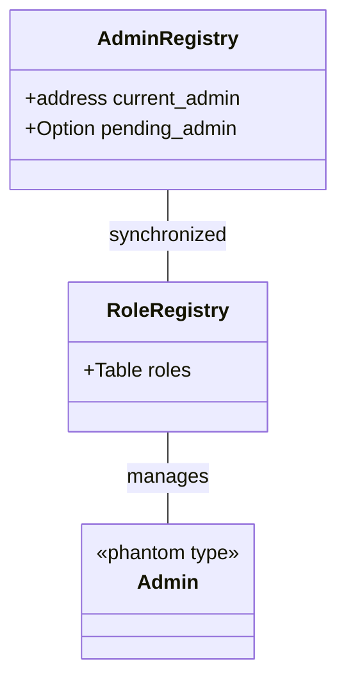
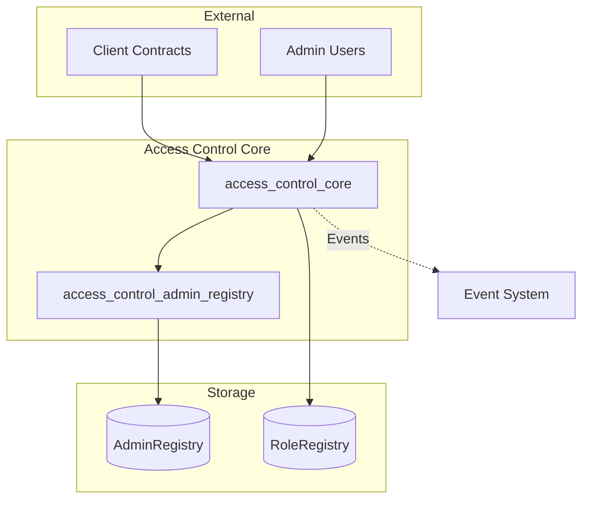
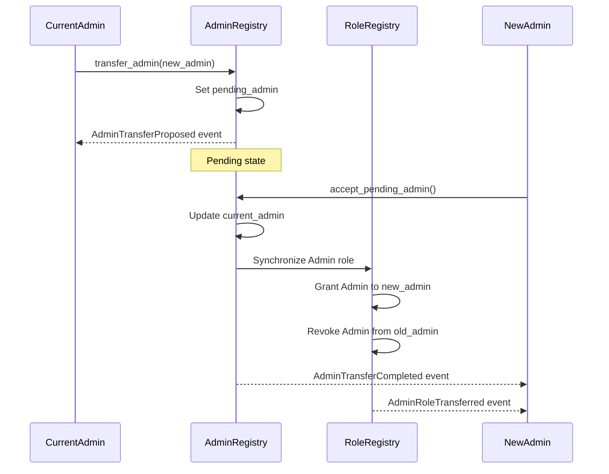
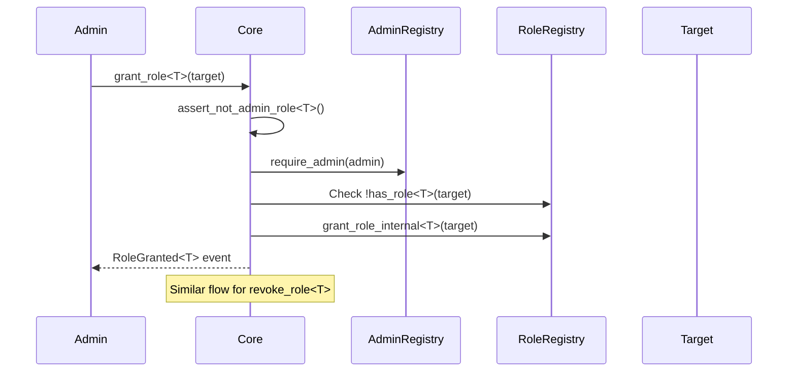
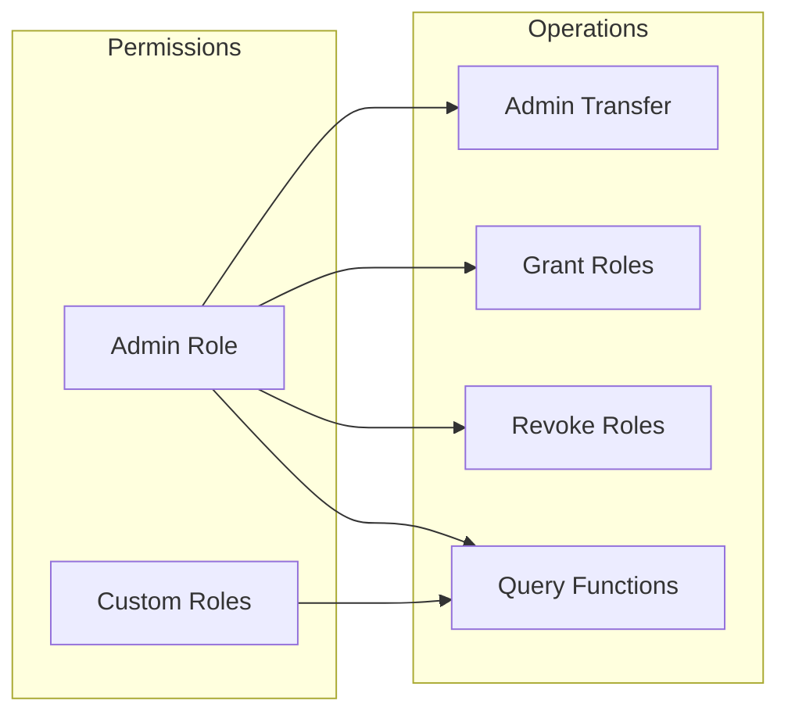

# Access Control Architecture

## Overview

The Aptos MoveKit Access Control system provides secure, type-safe role-based access control (RBAC) for smart contracts. It consists of two core modules that work together to manage admin privileges and role assignments.

## Core Components

### Modules

1. **`access_control_admin_registry`** - Manages admin transfers using a secure two-step process
2. **`access_control_core`** - Coordinates role management and delegates admin operations

### Data Structures



## System Architecture



## Admin Transfer Flow

The system uses a secure two-step transfer process to prevent accidental admin loss:



## Role Management Flow



## Security Model

### Protection Mechanisms

1. **Admin Role Protection** - Admin role cannot be manually granted/revoked
2. **Two-Step Transfer** - Prevents accidental admin loss
3. **Authorization Checks** - All operations validate admin permissions
4. **Type Safety** - Phantom types ensure compile-time role verification
5. **State Validation** - Prevents duplicate assignments and missing roles

### Access Control Matrix



## Event System

All operations emit events for audit trails:

- `AdminTransferProposed` - Admin transfer initiated
- `AdminTransferCompleted` - Admin transfer completed
- `AdminTransferCanceled` - Admin transfer canceled
- `AdminRoleTransferred` - Admin role synchronized in RoleRegistry
- `RoleGranted<T>` - Custom role granted
- `RoleRevoked<T>` - Custom role revoked

## Usage Patterns

### Role Definition
```move
struct Treasurer has copy, drop {}
struct Manager has copy, drop {}
```

### Permission Checks
```move
public entry fun sensitive_operation(account: &signer) {
    access_control_core::require_role<Treasurer>(account);
    // operation logic
}
```

### Admin Operations
```move
// Grant role (admin only)
access_control_core::grant_role<Treasurer>(admin, target_address);

// Transfer admin (two-step)
access_control_core::transfer_admin(admin, new_admin_address);
access_control_core::accept_pending_admin(new_admin);
```

## Design Principles

1. **Separation of Concerns** - Admin management separate from role management
2. **Fail-Safe Defaults** - Graceful handling of uninitialized states
3. **Atomic Operations** - State changes are consistent across registries  
4. **Storage Efficiency** - Cleanup of empty role maps
5. **Auditability** - Comprehensive event emission

## Integration Points

External contracts integrate through:
- `require_role<T>()` for permission checks
- `has_role<T>()` for conditional logic
- View functions for role queries
- Event listening for audit systems